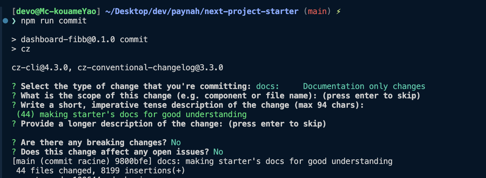
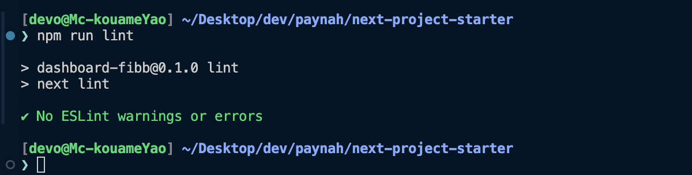
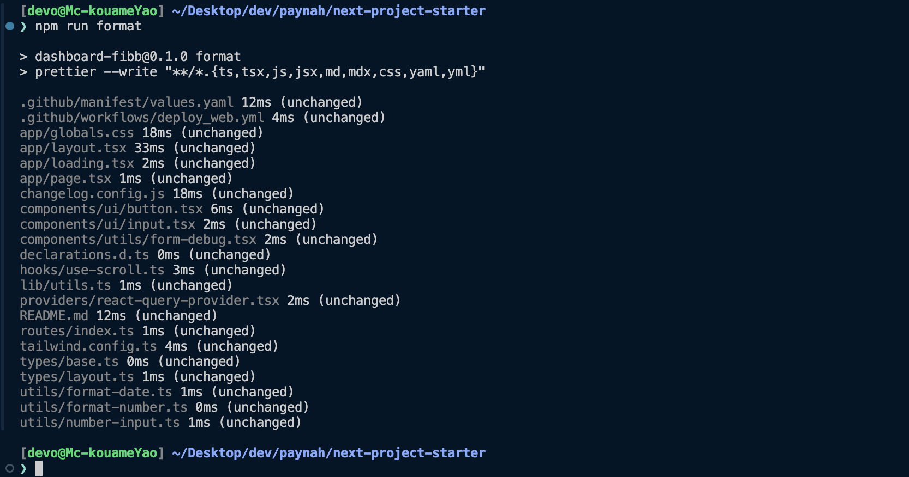

# [a]sernum and Paynah next project starter

- ## To clone

```bash
git clone https://github.com/Asernum/next-project-starter.git new-project
cd new-project

# then
npm install
 # ou
yarn
 # ou
pnpm install
```



- ## Project structure

- ### Before un commit

```bash
npm run lint
 # ou
yarn lint
 # ou
pnpm run lint
```



```bash
npm run format
 # ou
yarn format
 # ou
pnpm run format
```



- ### To make a commit

```bash
npm run commit
 # ou
yarn commit
 # ou
pnpm run commit
```


